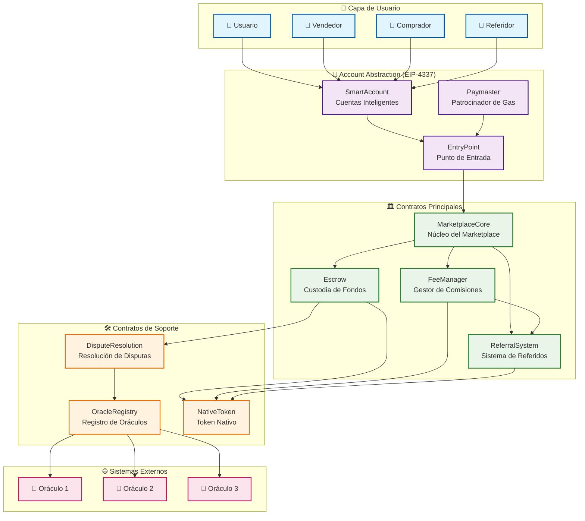
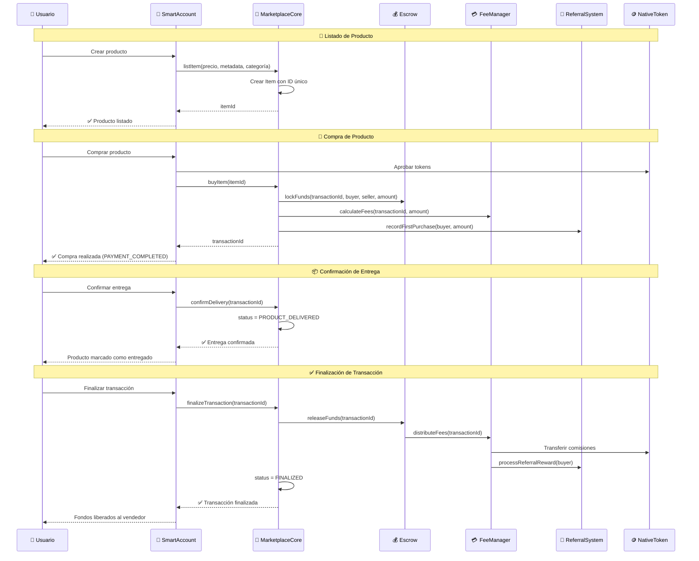
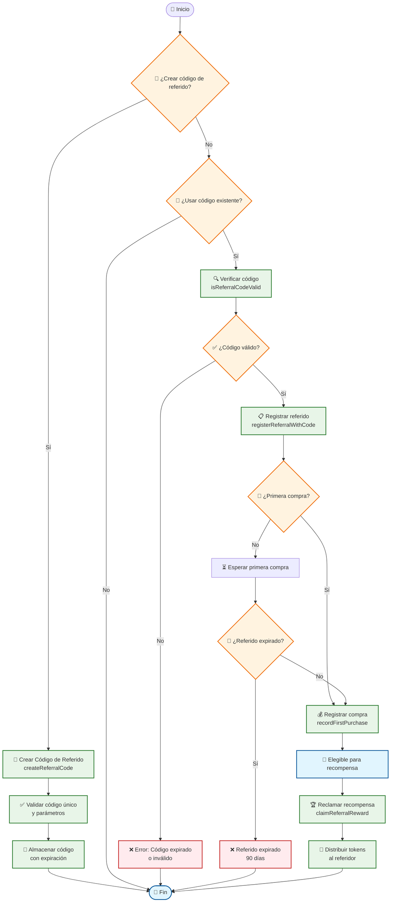
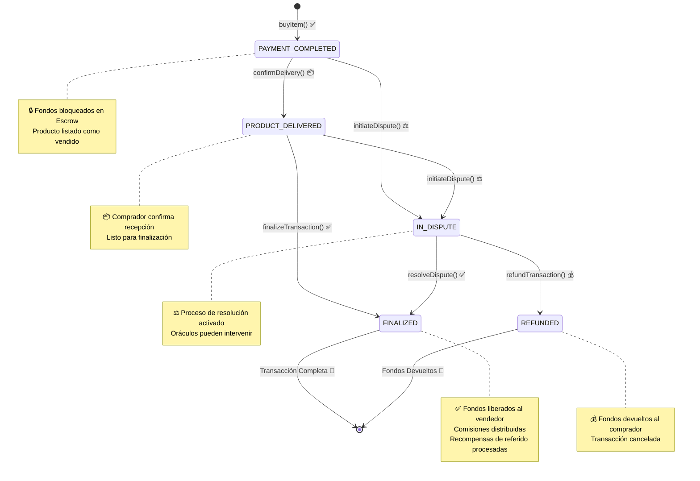
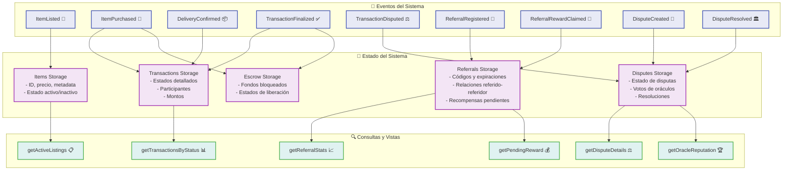

# Diagrama de Flujo - Sistema Koneque Marketplace

## 📋 Arquitectura General del Sistema



## 🔄 Flujo de Transacciones



## 🤝 Flujo del Sistema de Referidos



## 🏛️ Estados de Transacciones



## 🔧 Arquitectura de Contratos

```mermaid
graph LR
    subgraph "🎯 Frontend Layer"
        DAPP[📱 DApp Interface]
        WALLET[👛 Wallet Connection]
    end

    subgraph "🔐 Account Abstraction"
        SA[SmartAccount]
        PM[Paymaster]
        EP[EntryPoint]
    end

    subgraph "🏪 Marketplace Core"
        MC[MarketplaceCore<br/>- listItem()<br/>- buyItem()<br/>- confirmDelivery()<br/>- finalizeTransaction()]
        
        subgraph "💰 Financial Layer"
            ESC[Escrow<br/>- lockFunds()<br/>- releaseFunds()<br/>- Emergency functions]
            FM[FeeManager<br/>- calculateFees()<br/>- distributeFees()<br/>- Platform fees]
        end
        
        subgraph "🤝 Incentives Layer"
            RS[ReferralSystem<br/>- createReferralCode()<br/>- registerReferralWithCode()<br/>- claimReferralReward()]
        end
    end

    subgraph "⚖️ Governance Layer"
        DR[DisputeResolution<br/>- createDispute()<br/>- resolveDispute()<br/>- Oracle voting]
        OR[OracleRegistry<br/>- registerOracle()<br/>- Stake management<br/>- Reputation system]
    end

    subgraph "🪙 Token Layer"
        NT[NativeToken<br/>- ERC20 + Staking<br/>- Mint/Burn<br/>- Rewards distribution]
    end

    %% Frontend connections
    DAPP --> WALLET
    WALLET --> SA

    %% Account Abstraction flow
    SA --> EP
    PM --> EP
    EP --> MC

    %% Core marketplace connections
    MC --> ESC
    MC --> FM
    MC --> RS

    %% Financial layer connections
    ESC --> FM
    ESC --> DR
    FM --> RS

    %% Governance connections
    DR --> OR
    OR --> NT

    %% Token connections
    ESC --> NT
    FM --> NT
    RS --> NT

    %% Styling
    classDef frontendClass fill:#e3f2fd,stroke:#1565c0,stroke-width:2px
    classDef accountClass fill:#f3e5f5,stroke:#7b1fa2,stroke-width:2px
    classDef coreClass fill:#e8f5e8,stroke:#388e3c,stroke-width:2px
    classDef financialClass fill:#fff8e1,stroke:#f57c00,stroke-width:2px
    classDef incentiveClass fill:#e0f2f1,stroke:#00695c,stroke-width:2px
    classDef governanceClass fill:#fce4ec,stroke:#ad1457,stroke-width:2px
    classDef tokenClass fill:#f1f8e9,stroke:#558b2f,stroke-width:2px

    class DAPP,WALLET frontendClass
    class SA,PM,EP accountClass
    class MC coreClass
    class ESC,FM financialClass
    class RS incentiveClass
    class DR,OR governanceClass
    class NT tokenClass
```

## 📊 Flujo de Datos y Eventos



## 🛡️ Seguridad y Control de Acceso

```mermaid
graph TD
    subgraph "👑 Roles de Administración"
        OWNER[Owner<br/>🔑 Control total del sistema]
        MARKETPLACE[MarketplaceCore<br/>🏪 Operaciones principales]
        ESCROW_ROLE[Escrow<br/>💰 Gestión de fondos]
    end

    subgraph "🔒 Controles de Acceso"
        MOD1[onlyOwner<br/>- Configuración del sistema<br/>- Emergency functions<br/>- Fee management]
        MOD2[onlyMarketplace<br/>- Record purchases<br/>- Fee distribution<br/>- State updates]
        MOD3[onlyEscrow<br/>- Fund releases<br/>- Status updates<br/>- Refund processing]
    end

    subgraph "🛡️ Validaciones de Seguridad"
        VAL1[ReentrancyGuard<br/>🔒 Prevención de reentrancy]
        VAL2[Input Validation<br/>✅ Validación de parámetros]
        VAL3[State Checks<br/>📊 Verificación de estados]
        VAL4[Time Validations<br/>⏰ Validación de fechas]
    end

    subgraph "🚨 Funciones de Emergencia"
        EMERGENCY[Emergency Functions<br/>- pauseSystem()<br/>- emergencyWithdraw()<br/>- updateCriticalParams()]
    end

    OWNER --> MOD1
    MARKETPLACE --> MOD2
    ESCROW_ROLE --> MOD3

    MOD1 --> VAL1
    MOD2 --> VAL2
    MOD3 --> VAL3
    MOD1 --> VAL4

    MOD1 --> EMERGENCY

    %% Styling
    classDef roleClass fill:#ffecb3,stroke:#ff8f00,stroke-width:2px
    classDef controlClass fill:#e1f5fe,stroke:#0277bd,stroke-width:2px
    classDef validationClass fill:#e8f5e8,stroke:#388e3c,stroke-width:2px
    classDef emergencyClass fill:#ffebee,stroke:#d32f2f,stroke-width:2px

    class OWNER,MARKETPLACE,ESCROW_ROLE roleClass
    class MOD1,MOD2,MOD3 controlClass
    class VAL1,VAL2,VAL3,VAL4 validationClass
    class EMERGENCY emergencyClass
```

---

## 📈 Métricas del Sistema

- **38 Tests** ejecutándose exitosamente ✅
- **12 Contratos** interconectados
- **5 Estados** de transacciones
- **Account Abstraction** completamente integrado
- **Sistema de Referidos** con códigos y expiraciones
- **Resolución de Disputas** con oráculos
- **Gestión de Comisiones** automatizada
- **Token Nativo** con staking integrado

El diagrama muestra la arquitectura completa del sistema Koneque Marketplace, destacando las interacciones entre contratos, flujos de datos, estados de transacciones y medidas de seguridad implementadas.
