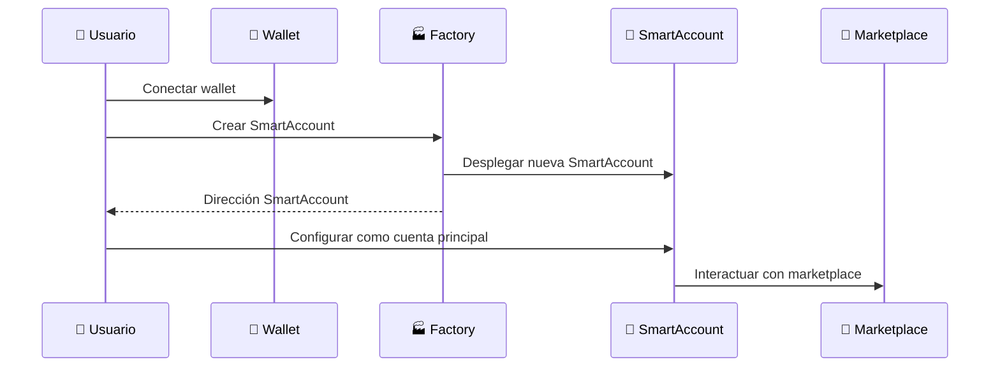
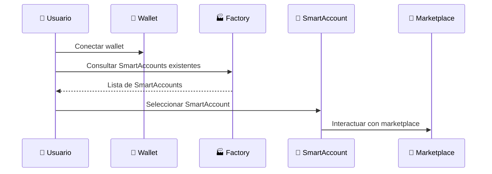

# 🔐 Guía de SmartAccounts en Koneque

## ¿Qué es una SmartAccount?

Una **SmartAccount** es una cuenta inteligente que implementa EIP-4337 (Account Abstraction), permitiendo funcionalidades avanzadas como:

- 🔑 **Múltiples propietarios** 
- 🛡️ **Guardián de recuperación**
- 📦 **Ejecución por lotes**
- 💰 **Patrocinio de gas** (gasless transactions)
- 🔒 **Controles de seguridad avanzados**

## 🚀 Cómo Crear una SmartAccount

### Opción 1: Creación Manual con Salt Específico

```solidity
// Desde el frontend o un contrato
SmartAccountFactory factory = SmartAccountFactory(FACTORY_ADDRESS);

bytes32 salt = keccak256("mi-salt-unico");
address owner = msg.sender; // O la wallet del usuario

address smartAccount = factory.createSmartAccount(owner, salt);
```

### Opción 2: Creación Automática (Recomendado)

```solidity
// Salt generado automáticamente
address smartAccount = factory.createSmartAccountAutoSalt(owner);
```

### Opción 3: Predicción de Dirección (Útil para UX)

```solidity
// Predecir dirección antes de crear
bytes32 salt = keccak256("mi-salt");
address predictedAddress = factory.getSmartAccountAddress(salt);

// Luego crear con el mismo salt
address actualAddress = factory.createSmartAccount(owner, salt);
// predictedAddress == actualAddress ✅
```

## 📱 Integración Frontend

### JavaScript/TypeScript Example

```javascript
import { ethers } from 'ethers';

class SmartAccountManager {
    constructor(provider, factoryAddress) {
        this.provider = provider;
        this.factory = new ethers.Contract(factoryAddress, FACTORY_ABI, provider);
    }

    // 1. Verificar si el usuario ya tiene SmartAccounts
    async getUserAccounts(userAddress) {
        return await this.factory.getUserAccounts(userAddress);
    }

    // 2. Crear nueva SmartAccount
    async createSmartAccount(ownerAddress, signer) {
        const factoryWithSigner = this.factory.connect(signer);
        const tx = await factoryWithSigner.createSmartAccountAutoSalt(ownerAddress);
        const receipt = await tx.wait();
        
        // Extraer dirección del evento
        const event = receipt.events.find(e => e.event === 'SmartAccountCreated');
        return event.args.smartAccount;
    }

    // 3. Obtener o crear SmartAccount
    async getOrCreateSmartAccount(userAddress, signer) {
        const existingAccounts = await this.getUserAccounts(userAddress);
        
        if (existingAccounts.length > 0) {
            return existingAccounts[0]; // Usar la primera
        }
        
        return await this.createSmartAccount(userAddress, signer);
    }
}

// Uso en el frontend
const smartAccountManager = new SmartAccountManager(provider, FACTORY_ADDRESS);

async function connectWalletAndSetupSmartAccount() {
    // 1. Conectar wallet tradicional
    const provider = new ethers.providers.Web3Provider(window.ethereum);
    const signer = provider.getSigner();
    const userAddress = await signer.getAddress();

    // 2. Obtener o crear SmartAccount
    const smartAccountAddress = await smartAccountManager.getOrCreateSmartAccount(
        userAddress, 
        signer
    );

    console.log('SmartAccount creada/encontrada:', smartAccountAddress);
    
    // 3. Ahora usar la SmartAccount para interactuar con el marketplace
    return smartAccountAddress;
}
```

## 🔄 Flujos de Uso Recomendados

### 1. **Primer Uso (Usuario Nuevo)**



### 2. **Usuario Existente**



## 💡 Estrategias de Implementación

### Estrategia 1: SmartAccount por Defecto
```javascript
// Crear automáticamente al conectar wallet
async function onWalletConnect(userAddress, signer) {
    const smartAccount = await getOrCreateSmartAccount(userAddress, signer);
    
    // Guardar en localStorage para próximas sesiones
    localStorage.setItem('defaultSmartAccount', smartAccount);
    
    return smartAccount;
}
```

### Estrategia 2: Múltiples SmartAccounts
```javascript
// Permitir al usuario gestionar múltiples cuentas
async function createNewSmartAccount(userAddress, signer, accountName) {
    const smartAccount = await createSmartAccount(userAddress, signer);
    
    // Guardar con nombre personalizado
    const accounts = JSON.parse(localStorage.getItem('smartAccounts') || '[]');
    accounts.push({ address: smartAccount, name: accountName });
    localStorage.setItem('smartAccounts', JSON.stringify(accounts));
    
    return smartAccount;
}
```

### Estrategia 3: SmartAccount bajo demanda
```javascript
// Crear solo cuando sea necesario (primera transacción)
async function ensureSmartAccount(userAddress, signer) {
    if (!localStorage.getItem('smartAccount')) {
        const smartAccount = await createSmartAccount(userAddress, signer);
        localStorage.setItem('smartAccount', smartAccount);
    }
    
    return localStorage.getItem('smartAccount');
}
```

## 🔧 Configuración Avanzada

### Añadir Múltiples Propietarios

```solidity
SmartAccount account = SmartAccount(smartAccountAddress);

// Añadir propietario adicional
account.addOwner(newOwnerAddress);

// Remover propietario
account.removeOwner(oldOwnerAddress);
```

### Configurar Guardián de Recuperación

```solidity
// Establecer guardián para recuperación
account.setGuardian(guardianAddress);
```

### Ejecución por Lotes

```solidity
ISmartAccount.Operation[] memory operations = new ISmartAccount.Operation[](2);

operations[0] = ISmartAccount.Operation({
    target: marketplaceAddress,
    value: 0,
    data: abi.encodeWithSignature("buyItem(uint256)", itemId1)
});

operations[1] = ISmartAccount.Operation({
    target: marketplaceAddress,
    value: 0,
    data: abi.encodeWithSignature("buyItem(uint256)", itemId2)
});

account.executeBatch(operations);
```

## 🎯 Mejores Prácticas

### ✅ Recomendado:

1. **Crear SmartAccount al conectar wallet por primera vez**
2. **Usar `createSmartAccountAutoSalt()` para simplicidad**
3. **Guardar dirección en localStorage del frontend**
4. **Verificar existencia antes de crear nueva**
5. **Implementar UX que oculte la complejidad al usuario**

### ❌ Evitar:

1. Crear múltiples SmartAccounts innecesariamente
2. No guardar la dirección (pérdida de referencia)
3. Exponer complejidad técnica al usuario final
4. No verificar si ya existe una SmartAccount

## 📊 Ejemplo Completo de Integración

```javascript
class KonequeWalletManager {
    async initialize() {
        this.provider = new ethers.providers.Web3Provider(window.ethereum);
        this.factory = new ethers.Contract(FACTORY_ADDRESS, FACTORY_ABI, this.provider);
    }

    async connectWallet() {
        // 1. Conectar wallet tradicional
        await window.ethereum.request({ method: 'eth_requestAccounts' });
        const signer = this.provider.getSigner();
        const userAddress = await signer.getAddress();

        // 2. Obtener o crear SmartAccount
        const smartAccountAddress = await this.getOrCreateSmartAccount(userAddress, signer);

        // 3. Configurar SmartAccount como principal
        this.smartAccount = new ethers.Contract(smartAccountAddress, SMART_ACCOUNT_ABI, signer);

        return {
            walletAddress: userAddress,
            smartAccountAddress: smartAccountAddress
        };
    }

    async interactWithMarketplace(methodName, params) {
        // Usar SmartAccount para todas las interacciones
        const marketplaceData = marketplace.interface.encodeFunctionData(methodName, params);
        
        return await this.smartAccount.execute(
            MARKETPLACE_ADDRESS,
            0,
            marketplaceData
        );
    }
}
```

Esta implementación proporciona una experiencia de usuario fluida donde la SmartAccount se crea automáticamente y se gestiona de manera transparente para el usuario final.
